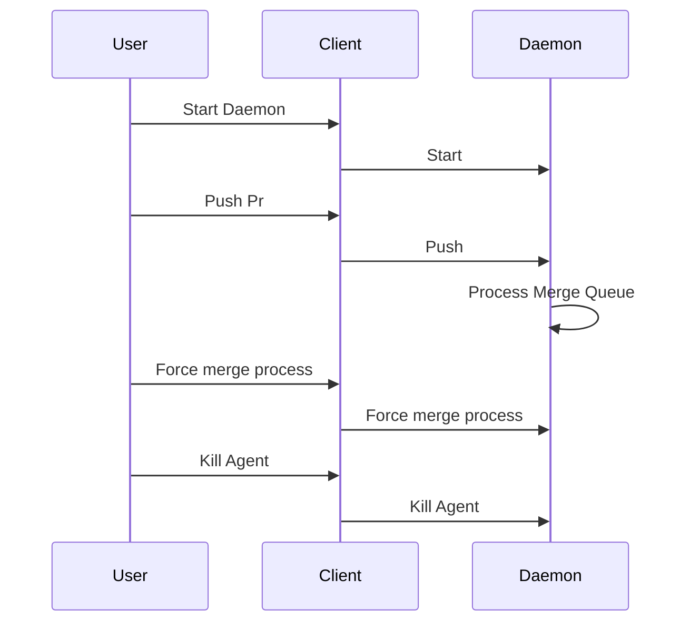

<!-- DO NOT REMOVE - contributor_list:data:start:["gleich"]:end -->

# rusty-merge

[](https://github.com/liberatys/rusty-merge/actions/workflows/lint.yml)
[](https://github.com/liberatys/rusty-merge/actions/workflows/build.yml)
[](https://github.com/liberatys/rusty-merge/actions/workflows/test.yml)

A merge utility for your dependabot / depfu workflow.
Just add the pull request to the queue and walk away.
The merge process will handle pull request updates, pending CI and other
operations needed to get your pull request through.

## Installation

    cargo install rusty-merge

## Usage

    rusty-merge agent -> Starts the daemon
    rusty-merge push [URL to Pull Request]

Either wait for the scheduler to run the process for the merger or force a run

    rusty-merge force -> Run the merger process now

## Workflow



## Commands
```bash
    SUBCOMMANDS:
        agent    run the agent
        clear    clear the current queue
        force    force the current queue process
        help     Print this message or the help of the given subcommand(s)
        list     list the current queue
        pop      pop a pull request from the queue
        push     push a pull request into the queue
```

## 🙌 Contributing

We would love to have you contribute! Please read the [contributing guide](CONTRIBUTING.md) before submitting a pull request. Thank you in advance!

<!-- prettier-ignore-start -->
<!-- DO NOT REMOVE - contributor_list:start -->
## 👥 Contributors


- **[@Liberatys](https://github.com/Liberatys)**

<!-- DO NOT REMOVE - contributor_list:end -->
<!-- prettier-ignore-end -->
